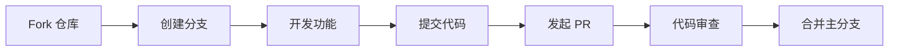

<div align="center">

# 🌟 TG-Image 云端图床 🌟

<p align="center">
  
</p>

<p align="center">
  <strong>✨ 基于 Telegram 的现代化云端图片托管服务 ✨</strong>
</p>

<p align="center">
  <em>🚀 无限存储 • 🔒 安全可靠 • 🎨 精美界面 • 📱 响应式设计</em>
</p>

---

<p align="center">
  <a href="https://github.com/xiyewuqiu/new-lmage/stargazers">
    
  </a>
  <a href="https://github.com/xiyewuqiu/new-lmage/network/members">
    
  </a>
  <a href="https://github.com/xiyewuqiu/new-lmage/issues">
    
  </a>
  <a href="LICENSE">
    
  </a>
</p>

<p align="center">
  <a href="https://telegram.org/">
    
  </a>
  <a href="https://workers.cloudflare.com/">
    
  </a>
  <a href="https://hono.dev/">
    
  </a>
</p>

---

## 🌈 产品亮点

<table>
  <tr>
    <td align="center" width="33%">
      <h3>🚀 极速上传</h3>
      <p>拖拽、点击、粘贴三种上传方式<br>支持批量处理，一键搞定</p>
    </td>
    <td align="center" width="33%">
      <h3>💎 原图品质</h3>
      <p>基于Telegram存储引擎<br>保证图片原始分辨率与画质</p>
    </td>
    <td align="center" width="33%">
      <h3>🎨 视觉盛宴</h3>
      <p>现代化UI设计，暗黑模式<br>3D卡片效果，丝滑动画</p>
    </td>
  </tr>
  <tr>
    <td align="center">
      <h3>📱 全端适配</h3>
      <p>完美适配各种设备尺寸<br>移动端体验媲美原生应用</p>
    </td>
    <td align="center">
      <h3>🔐 账户体系</h3>
      <p>JWT安全认证，隐私保护<br>个人图片库独立管理</p>
    </td>
    <td align="center">
      <h3>📊 智能统计</h3>
      <p>可视化数据图表<br>上传趋势一目了然</p>
    </td>
  </tr>
</table>

</div>

---

## ⚡ 核心特性

<details>
<summary>🎯 <strong>上传体验</strong> - 点击展开详情</summary>

### 🔥 多种上传方式
- **拖拽上传** - 直接拖放图片到浏览器
- **点击上传** - 传统文件选择器
- **粘贴上传** - `Ctrl+V` 快捷键支持
- **批量上传** - 一次处理多张图片

### ⚡ 智能处理
- 自动格式识别与优化
- 实时上传进度显示
- 错误重试机制
- 文件大小智能检测

</details>

<details>
<summary>👤 <strong>用户系统</strong> - 点击展开详情</summary>

### 🛡️ 安全认证
- JWT令牌加密验证
- 安全的密码哈希存储
- 用户会话管理
- 隐私数据保护

### 📱 个人中心
- 头像自定义设置
- 个人资料管理
- 账户统计信息
- 偏好设置保存

</details>

<details>
<summary>🖼️ <strong>图片管理</strong> - 点击展开详情</summary>

### 🎛️ 多视图模式
- **网格视图** - 瀑布流布局
- **列表视图** - 详细信息展示
- **时间线视图** - 按时间排序

### 🔍 强大搜索
- 文件名模糊搜索
- 标签分类筛选
- 日期范围过滤
- 收藏状态筛选

### ⭐ 收藏功能
- 一键收藏/取消收藏
- 收藏列表独立查看
- 快速收藏状态切换

### 🎯 拖拽排序
- 自由调整图片顺序
- 实时拖拽反馈
- 自定义排列方式

</details>

<details>
<summary>📊 <strong>数据可视化</strong> - 点击展开详情</summary>

### 📈 图表统计
- 上传趋势动态图表
- 存储空间使用分析
- 文件类型分布饼图
- 活跃度统计曲线

### 📋 实时数据
- 总文件数量统计
- 累计存储空间
- 平均文件大小
- 最近活跃时间

</details>

---

## 🛠️ 技术架构

<div align="center">

### 🏗️ 现代化技术栈

<table>
  <tr>
    <th align="center">🔧 组件</th>
    <th align="center">🚀 技术</th>
    <th align="center">📝 描述</th>
  </tr>
  <tr>
    <td align="center"><strong>前端框架</strong></td>
    <td align="center">
      
      
      
    </td>
    <td align="center">原生JS，无框架依赖</td>
  </tr>
  <tr>
    <td align="center"><strong>后端服务</strong></td>
    <td align="center">
      
      
    </td>
    <td align="center">轻量级Web框架 + 边缘计算</td>
  </tr>
  <tr>
    <td align="center"><strong>数据存储</strong></td>
    <td align="center">
      
      
    </td>
    <td align="center">图片存储 + 元数据缓存</td>
  </tr>
  <tr>
    <td align="center"><strong>部署平台</strong></td>
    <td align="center">
      
      
    </td>
    <td align="center">全球CDN分发 + 命令行部署</td>
  </tr>
  <tr>
    <td align="center"><strong>UI组件</strong></td>
    <td align="center">
      
      
    </td>
    <td align="center">数据可视化 + 拖拽排序</td>
  </tr>
  <tr>
    <td align="center"><strong>开发工具</strong></td>
    <td align="center">
      
      
    </td>
    <td align="center">运行环境 + 包管理器</td>
  </tr>
</table>

</div>

---

## 🚀 快速开始

### 📋 前置要求

<div align="center">

| 🛠️ 工具 | 📝 描述 | 🔗 链接 |
|---------|--------|--------|
| **Cloudflare 账户** | 免费注册，部署必需 | [注册链接](https://cloudflare.com) |
| **Telegram Bot** | 通过 @BotFather 创建 | [创建教程](https://t.me/BotFather) |
| **Node.js 环境** | 版本 16+ 推荐 | [下载地址](https://nodejs.org/) |

</div>

### ⚡ 一键部署

```bash
# 🔽 克隆仓库
git clone https://github.com/xiyewuqiu/new-lmage.git
cd new-lmage

# 📦 安装依赖
npm install

# 🔑 登录 Cloudflare
npx wrangler login

# ⚙️ 配置环境变量 (编辑 wrangler.toml)
# 填入您的 Telegram Bot Token 和 Chat ID

# 🚀 一键部署
npm run setup
```

### 🎯 环境配置

<details>
<summary>📝 <strong>wrangler.toml 配置详情</strong></summary>

```toml
[vars]
# 🤖 Telegram Bot 令牌
TG_Bot_Token = "YOUR_BOT_TOKEN"

# 💬 Telegram 聊天/频道 ID  
TG_Chat_ID = "YOUR_CHAT_ID"

# 🔐 JWT 密钥 (生产环境请修改)
JWT_SECRET = "your-secure-jwt-secret"
```

</details>

### 🎉 部署成功

部署完成后，您将获得：
- 🌐 **专属域名** - Cloudflare Pages 自动分配
- ⚡ **全球加速** - CDN 边缘节点优化
- 🔒 **HTTPS 安全** - 自动SSL证书配置
- 📱 **PWA 支持** - 可安装到桌面/手机

---

## 🎨 界面预览

<div align="center">

### 🌓 双主题模式

<table>
  <tr>
    <td align="center" width="50%">
      <h4>☀️ 明亮模式</h4>
      <p><em>清新简洁的白昼风格</em></p>
    </td>
    <td align="center" width="50%">
      <h4>🌙 暗黑模式</h4>
      <p><em>护眼舒适的夜间风格</em></p>
    </td>
  </tr>
</table>

### 📱 响应式布局

<table>
  <tr>
    <td align="center" width="33%">
      <h4>🖥️ 桌面端</h4>
      <p>大屏幕优化布局</p>
    </td>
    <td align="center" width="33%">
      <h4>📱 平板端</h4>
      <p>中等屏幕适配</p>
    </td>
    <td align="center" width="33%">
      <h4>📱 手机端</h4>
      <p>移动端专属体验</p>
    </td>
  </tr>
</table>

</div>

---

## 📚 使用指南

### 🎯 匿名上传

1. **访问网站** 🌐 - 打开您的TG-Image服务
2. **选择图片** 📸 - 拖拽/点击/粘贴上传
3. **获取链接** 🔗 - 自动生成多种格式链接
4. **立即使用** ✨ - 复制分享给好友

### 👤 注册账户

<details>
<summary>🔓 <strong>账户功能解锁</strong></summary>

#### 📋 注册流程
1. 点击右上角"登录"按钮
2. 选择"注册新账户"
3. 填写用户名、邮箱、密码
4. 验证邮箱完成注册

#### 🎁 会员特权
- 📂 **图片管理** - 查看所有上传的图片
- 🏷️ **标签系统** - 为图片添加分类标签
- 🔍 **高级搜索** - 多维度搜索过滤
- ⭐ **收藏功能** - 标记重要图片
- 📊 **数据统计** - 可视化使用报告
- 🎛️ **个性设置** - 自定义界面布局

</details>

### 🛠️ 高级功能

<details>
<summary>⚙️ <strong>专业工具</strong></summary>

#### 🖼️ 图片编辑器
- 基础裁剪和缩放
- 滤镜效果应用
- 压缩质量调节
- 格式转换功能

#### 📦 批量处理
- 多图片同时编辑
- 批量添加水印
- 统一尺寸调整
- 批量格式转换

#### 🔗 分享工具
- 多平台分享链接
- 二维码生成
- 嵌入代码生成
- 社交媒体优化

</details>

---

## 🔧 开发指南

### 🏗️ 本地开发

```bash
# 🔧 启动开发服务器
npm run dev

# 🌐 访问本地服务
# http://localhost:8787
```

### 📦 构建部署

```bash
# 🏗️ 构建项目
npm run build

# 🚀 部署到 Cloudflare
npm run deploy
```

### 🧪 调试技巧

<details>
<summary>🔍 <strong>调试工具</strong></summary>

#### 📊 日志查看
```bash
# 实时日志
npx wrangler tail

# 部署日志
npx wrangler logs
```

#### 🧪 本地测试
```bash
# KV 存储测试
npm run create-kv

# 函数测试
npm test
```

</details>

---

## 📈 更新日志

<div align="center">

### 🎉 版本历程

</div>

<details>
<summary>🆕 <strong>v2.5.0 (2025.05.21)</strong> - 最新版本</summary>

#### ✨ 新增功能
- 📊 **数据可视化大升级** - Chart.js 图表集成
- 🎛️ **多视图模式** - 网格/列表/时间线三种视图
- ⭐ **图片收藏系统** - 一键收藏，快速筛选
- 🎯 **拖拽排序功能** - SortableJS 自由排序
- 🎨 **界面美化重构** - 全新视觉设计语言

#### 🔧 性能优化
- ⚡ 图片加载速度提升 40%
- 📱 移动端响应速度优化
- 🔄 动画效果流畅度改善
- 💾 本地缓存策略优化

</details>

<details>
<summary>🎁 <strong>v2.0.0 (2025.05.18)</strong></summary>

#### 🚀 重大更新
- ✨ **粘贴上传功能** - Ctrl+V 快捷操作
- 🎬 **动画效果升级** - 丰富的交互反馈
- 🌊 **上传流程统一** - 一致的用户体验
- 🎨 **四大模块美化** - 视觉效果全面提升

</details>

<details>
<summary>🎯 <strong>v1.5.0 (2025.05.14)</strong></summary>

#### 🔐 安全升级
- 👤 **用户认证系统** - 注册/登录/JWT认证
- 🖼️ **图片管理功能** - 个人图库管理
- 📱 **移动端优化** - 触摸操作友好
- ⚡ **性能提升** - 页面加载速度优化

</details>

---

## 🤝 贡献指南

<div align="center">

### 💝 参与开源，共建生态

我们欢迎所有形式的贡献！

</div>

#### 🎯 贡献方式

<table>
  <tr>
    <td align="center" width="25%">
      <h4>🐛 报告问题</h4>
      <p>发现Bug？立即报告</p>
      <a href="https://github.com/xiyewuqiu/new-lmage/issues/new?template=bug_report.md">
        
      </a>
    </td>
    <td align="center" width="25%">
      <h4>💡 功能建议</h4>
      <p>有好想法？告诉我们</p>
      <a href="https://github.com/xiyewuqiu/new-lmage/issues/new?template=feature_request.md">
        
      </a>
    </td>
    <td align="center" width="25%">
      <h4>🔧 代码贡献</h4>
      <p>提交Pull Request</p>
      <a href="https://github.com/xiyewuqiu/new-lmage/fork">
        
      </a>
    </td>
    <td align="center" width="25%">
      <h4>📖 完善文档</h4>
      <p>改进项目文档</p>
      <a href="https://github.com/xiyewuqiu/new-lmage/tree/main/docs">
        
      </a>
    </td>
  </tr>
</table>

#### 🚀 贡献流程



#### 📝 开发规范

<details>
<summary>🎯 <strong>代码标准</strong></summary>

##### 🏷️ 命名规范
- **文件名**: kebab-case (例: `image-editor.js`)
- **函数名**: camelCase (例: `uploadImage`)
- **常量名**: UPPER_SNAKE_CASE (例: `MAX_FILE_SIZE`)

##### 📁 目录结构
```
src/
├── functions/          # 业务逻辑
│   ├── file/          # 文件处理
│   ├── user/          # 用户管理
│   └── utils/         # 工具函数
public/
├── css/               # 样式文件
├── js/                # 前端脚本
└── images/            # 静态资源
```

##### ✍️ 提交规范
- `feat:` 新功能
- `fix:` 修复Bug
- `docs:` 文档更新
- `style:` 代码格式
- `refactor:` 代码重构
- `test:` 测试相关
- `chore:` 构建工具

</details>

---

## 📄 开源协议

<div align="center">

### ⚖️ GNU AGPL-3.0 with Commons Clause


</div>

#### 📋 协议要点

<table>
  <tr>
    <th align="center">✅ 允许</th>
    <th align="center">❌ 限制</th>
    <th align="center">📝 要求</th>
  </tr>
  <tr>
    <td align="center">
      • 自由使用<br>
      • 修改源码<br>
      • 分发副本<br>
      • 专利授权
    </td>
    <td align="center">
      • 商业销售<br>
      • 付费服务<br>
      • 收费咨询<br>
      • 私有化部署销售
    </td>
    <td align="center">
      • 开源修改<br>
      • 保留协议<br>
      • 网络服务开源<br>
      • 标注原作者
    </td>
  </tr>
</table>

<details>
<summary>🔍 <strong>协议详情</strong></summary>

#### 🔒 Commons Clause 限制
本项目采用 **AGPL-3.0 + Commons Clause** 双重协议：

- **AGPL-3.0**: 确保代码永远开源
- **Commons Clause**: 禁止商业销售

#### 💼 商业使用
如需商业用途，请联系获取商业许可证：
- 📧 **邮箱**: [xiyewuqiu@gmail.com](mailto:xiyewuqiu@gmail.com)
- 💬 **GitHub**: [项目Issues](https://github.com/xiyewuqiu/new-lmage/issues)

</details>

---

## 🌟 致谢名单

<div align="center">

### 🙏 特别感谢

<table>
  <tr>
    <td align="center" width="25%">
      <a href="https://telegram.org/">
        
      </a>
      <br><sub><b>🤖 Bot API</b></sub>
    </td>
    <td align="center" width="25%">
      <a href="https://workers.cloudflare.com/">
        
      </a>
      <br><sub><b>☁️ 边缘计算</b></sub>
    </td>
    <td align="center" width="25%">
      <a href="https://hono.dev/">
        
      </a>
      <br><sub><b>🚀 Web框架</b></sub>
    </td>
    <td align="center" width="25%">
      <a href="https://remixicon.com/">
        
      </a>
      <br><sub><b>🎨 图标库</b></sub>
    </td>
  </tr>
</table>

### 🏆 贡献者

感谢所有为项目贡献代码的开发者们！

<a href="https://github.com/xiyewuqiu/new-lmage/graphs/contributors">
  
</a>

</div>

---

## 📞 联系我们

<div align="center">

### 💬 获取帮助 & 技术支持

<table>
  <tr>
    <td align="center" width="33%">
      <h4>🐛 问题反馈</h4>
      <a href="https://github.com/xiyewuqiu/new-lmage/issues">
        
      </a>
      <br><sub>Bug报告 & 功能建议</sub>
    </td>
    <td align="center" width="33%">
      <h4>📧 邮件联系</h4>
      <a href="mailto:xiyewuqiu@gmail.com">
        
      </a>
      <br><sub>商务合作 & 技术咨询</sub>
    </td>
    <td align="center" width="33%">
      <h4>📚 项目文档</h4>
      <a href="https://github.com/xiyewuqiu/new-lmage/wiki">
        
      </a>
      <br><sub>使用教程 & API文档</sub>
    </td>
  </tr>
</table>

---

### 🎉 支持项目

如果这个项目对您有帮助，请给我们一个 ⭐️ Star！

<p align="center">
  <a href="https://github.com/xiyewuqiu/new-lmage">
    
  </a>
  <a href="https://github.com/xiyewuqiu/new-lmage">
    
  </a>
  <a href="https://github.com/xiyewuqiu/new-lmage">
    
  </a>
</p>

---

<p align="center">
  
</p>

<p align="center">
  <sub>🌈 让每一张图片都有最好的归宿 🌈</sub>
</p>

<p align="center">
  <sub>Made with ❤️ by <a href="https://github.com/xiyewuqiu">xiyewuqiu</a> • © 2025 TG-Image</sub>
</p>

</div>
